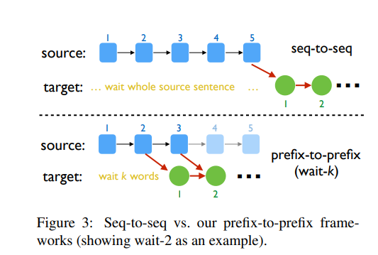

# 2022 NAACL 机器同传 Paddle方案【中英第二】
##  赛事背景：

​	同声传译结合了机器翻译（MT）、自动语音识别（ASR）和文本语音合成（TTS）等人工智能技术，在国际会议、商务谈判、新闻发言、法律诉讼和医学交流等众多场景都有广泛的应用，已发展成为一个前沿的研究领域。作为一个新兴的跨学科领域，同声传译未来将面临更多挑战。

​		为推动机器同传技术的发展，在NAACL 2022顶会上，百度成功地申办了第三届同声传译研讨会，汇集了机器翻译、语音处理和人类口译领域的众多研究人员和实践者，共同讨论同声传译的最新进展和当下面临的突出挑战。

## 关于本项目

​	本项目基于PaddlePaddle框架，使用bpe-based Transformer作为翻译模型，waitk策略进行同传翻译，在[AutoSimulTrans22](https://aistudio.baidu.com/aistudio/competition/detail/148)中英文本赛道取得第二名，整理作为明年的baseline。

## 数据介绍


| 数据集 | 语言方向  | 数量 |
|-------|-------|-------|
| [CWMT21](http://mteval.cipsc.org.cn:81/agreement/AutoSimTrans) | Zh-En  | 9.1m |
| CWMT21 | Zh mono  | 1m |
| BSTC | Zh-En | 3.7w |
| 	[UN Parallel Corpus](https://conferences.unite.un.org/UNCORPUS/en/DownloadOverview#download) |  En-Es | 21m |

## 模型介绍

seq2seq架构的模型输入整个src，以及之前的tgt，从而预测后面的目标词，如图3中上；而prefix2prefix架构除了tgt的输入相同，源端仅输入部分前缀，从而生成目标端的部分：



本项目翻译模型结构如下所示，仅将transformer base的encoder数改为12：
| Configuration      | Value |
| ------------------ | ----- |
| Encoder depth      | 12    |
| Decoder depth      | 6     |
| Attention heads    | 8     |
| Embedding dim      | 512   |
| FFN size           | 2048  |
| Chinese vocab size | 45942 |
| English vocab size | 32151 |
| dropout            | 0.1   |

除此之外，使用了[DeepNet: Scaling Transformers to 1,000 Layers](https://arxiv.org/abs/2203.00555)一文的deepnorm初始化方式。


​		为了评估本项目的模型、训练、评估等的实现程度，遂与fairseq作比较，在2m的ccmt上训练base和本项目使用的deep encoder，参数和结果如下：

| lr   | warmup | optimizer      | schedule     | update-freq | dropout |
| ---- | ------ | -------------- | ------------ | ----------- | ------- |
| 5e-4 | 4000   | adam(0.9,0.98) | inverse_sqrt | 4           | 0.1     |

| Frame   | Arch           | Epoch | Bleu        | Speed（steps/s） |
| ------- | -------------- | ----- | ----------- | ---------------- |
| fairseq | base           | 16    | 23.08       | 10.5(3090)       |
| fairseq | big            | -     | -           | -                |
| paddle  | base           | 7     | **23.1846** | 3.4 （V100）     |
| paddle  | 12+6+deepnorm√ | 17    | 23.1153     | 2.8 （V100）     |
| paddle  | big            | -     | -           | 1.4 （V100）     |

​		目前来看在2m上，paddle版的base略胜于fairseq的base🤭，而本项目使用的12+6未看出比base强😫，可能需要在更大数据量上才会有更好的效果？挖个坑留待以后继续测。

​	

## 快速开始

### 1.准备工作

```shell
# 克隆至本地
git clone https://github.com/MiuGod0126/STACL_Paddle.git
cd STACL_Paddle
# 安装依赖
pip install -r requirements
```

### 2.目录结构

```
├── ckpt # 权重
├── configs #配置
├── dataset # 数据
│   ├── ccmt21
│   ├── bstc
│   ├── enes21
├── decode # waitk结果文件夹
├── examples # 回译代码
├── models #模型文件
├── reader # 数据加载
├── paddleseq_cli 
│   ├── preprocess.py # 二值化
│   ├── train.py # 训练
│   ├── valid.py # 评估
│   ├── generate.py # 生成
│   ├── config.py # 命令行参数
├── scripts # 训练、微调、评估、waitk预测、平均权重脚本
├── tools # al评估
├── output # 输出文件
├── requirements.txt # 依赖
├── README.md
```

### 3.数据处理

#### 3.1 预处理

- 分词：对于中文先用jieba分词；然后分别对中英（西）使用moses的normalize-punctuation和tokenizer。（事实上中文不需要用moses，而moses在解码后需要de-tokenizing）。
- 长度过滤：对于中英，过滤掉长度1-250，并且长度比例超过1:2.5或2.5:1的平行语料；对于英西，过滤掉长度1-250，并且长度比例超过1:1.5或1.5:1的平行语料。
- 语言标识过滤(lang id)：使用fasttext过滤掉源端或目标端任意一边不匹配语言标识的平行文本。
- 对于中文的单语，进行了去重，减少了3m。
- truecase： 对英西两种语言使用truecase，自动判断句中名字、地点等，选择何时的大小写形式，而非直接使用小写，解码后需要de-truecaseing。(中文不用，且此步需要训练模型，处理非常耗时)。
- BPE(双字节编码)分子词： 对于中英，各自使用32K次操作；对于英西，共享32K的子词词表；其中中->英的词表包含ccmt、bstc的训练集，以及ccmt的单语中文语料。

#### 3.2 二进制

​	本项目支持两种格式的数据输入，一是文本对，二是fairseq的二进制数据（能压缩一半），以bstc为例，若要生成bin数据，命令如下(bin数据的使用见：[这](#bin_load))：

```shell
workers=1
TEXT=dataset/bstc
python paddleseq_cli/preprocess.py \
        --source-lang zh --target-lang en \
        --srcdict $TEXT/vocab.zh --tgtdict  $TEXT/vocab.en \
        --trainpref $TEXT/asr.bpe --validpref $TEXT/dev.bpe --testpref $TEXT/dev.bpe  \
        --destdir data_bin/bstc_bin --thresholdtgt 0 --thresholdsrc 0 \
        --workers $workers
#⭐或
bash scripts/preprocess.sh
```

结果如下所示：

```
data_bin/bstc_bin/
    preprocess.log
    test.zh-en.en.idx
    test.zh-en.en.bin
    test.zh-en.zh.bin
    train.zh-en.en.bin
    test.zh-en.zh.idx
    train.zh-en.zh.bin
    train.zh-en.en.idx
    train.zh-en.zh.idx
    valid.zh-en.en.bin
    valid.zh-en.en.idx
    valid.zh-en.zh.bin
    valid.zh-en.zh.idx
```

**注意：在windows上支持workers>1,而在aistudio上目前只能用workers=1**

### 4.整句模型训练

以提供的中英ccmt翻译数据为例，可以执行如下命令进行模型训练：

```shell
# 单卡或多卡训练（设置ngpus）
ngpus=4
python paddleseq_cli/train.py --cfg configs/zhen_ccmt.yaml \
                         --amp \
                         --ngpus $ngpus  \
                         --update-freq 4 \
                         --max-epoch 10 \
                         --save-epoch 1 \
                         --save-dir /root/paddlejob/workspace/output \
                         --log-steps 100 \
                         --max-tokens 4096 \
#⭐或
bash scripts/train_full.sh
# 模型验证
python paddleseq_cli/train.py --cfg configs/zhen_ccmt.yaml  --pretrained ckpt/model_best_zhen --eval
```

对于中英在ccmt上训练后，还需用zhen_bstc.yaml进行微调：

```
├── configs #配置文件
│   ├── enes_un.yaml # 英西整句训练
│   ├── enes_waitk.yaml # 英西waitk
│   ├── zhen_ccmt.yaml # 中英整句预训练
│   ├── zhen_bstc.yaml # 中英整句微调
│   ├── zhen_bstc_bin.yaml # 中英整句微调(二进制)
│   ├── zhen_waitk.yaml # 中英waitk

```

除此之外，当数据量太大的时候有两种方法：

<a id="bin_load"></a>

1. 部分训练：修改配置文件中**train.train_data_size**，默认-1即加载全部。适用于需要快速加载调试，或用少量语料微调模型。
2. ⭐部分加载（全量训练）：使用迭代器，先获取一个pool大小的数据，然后再用MapDataset全量加载动态组batch，极大提升了数据加载速度并且防止爆内存。若要使用此功能，先使用数据准备中的命令生成二进制数据，然后修改配置文件中**data.use_binary**，**data.lazy_load**为True（别忘了修改数据前缀），详见**zhen_bstc_bin.yaml**，训练命令不变。


### 5.预测评估

以ccmt21为例，模型训练完成后可以执行以下命令对指定文件中的文本进行翻译，默认将结果输出到output/generate.txt：

```shell
python  paddleseq_cli/generate.py --cfg configs/zhen_ccmt.yaml \
				   --pretrained ckpt/model_best_zhen \
				   --beam-size 5 \
				   --generate-path generate.txt \
				   --sorted-path result.txt
				   # --only-src # 若test无目标文件用此参数

#⭐或
bash scripts/generate_full.sh
```

训练、验证曲线使用visualdl生成，命令为：

```shell
visualdl --logdir output/vislogs/zhen --port 8080
# 打开链接：localhost:8080
```

### 6.waitk训练

在ccmt 9m的数据集上训练后，再在bstc(zhen_bstc.yaml)上微调，最后再用waitk在bstc上微调同传模型，命令如下：

```shell
k=5 #整句k=-1
python paddleseq_cli/train.py --cfg configs/zhen_waitk.yaml \
            --waitk $k --pretrained ckpt/model_best_zhen

# ⭐或
bash scripts/train_wk.sh
```

### 7.流式输出

```shell
k=5
stream_prefix=dataset/stream_zh/dev/3
ckpt_dir=model_best_zhen # waitk微调好的权重
python paddleseq_cli/generate.py --cfg configs/zhen_waitk.yaml \
            --test-pref $stream_prefix --only-src \
            --pretrained  $ckpt_dir \
            --waitk $k --stream \
            --infer-bsz 1 --beam-size 5
# ⭐或
bash scripts/generate_wk.sh
```

以文件dataset/stream_zh/dev/3.zh为例，生成流式输出：

```
############## input ############## 
额 ，
额 ， 非
额 ， 非常
额 ， 非常 非
额 ， 非常 非常
额 ， 非常 非常 荣
额 ， 非常 非常 荣幸
额 ， 非常 非常 荣幸 能
额 ， 非常 非常 荣幸 能@@ 今
额 ， 非常 非常 荣幸 能 今天
############## output ############## 
Well
,

 it
 is
 a

 great
 honor


 to
 be

 here
```

### 8.waitk评估

dataset/Zh-En/dev含有多个文件，使用脚本一键对dev文件进行预测并评估bleu和al，中英一般要10多分钟。

```shell
# 中英
k=5
ckpt_dir=<ckpt_dir>
beam_size=1
bash scripts/gen_eval_zhen.sh dev $k $ckpt_dir $beam_size
# 英西
bash scripts/gen_eval_enes.sh dev $k $ckpt_dir $beam_size
```

**注：由于中英预测十数个文件，且显存和算力跑不满，我尝试shell多进程跑waitk预测，速度可以降到5min左右，但是精度显著降低了，暂不知原因，命令如下（gen_eval_zhen_paral.sh）：**

```shell
# 中英
k=5
ckpt_dir=<ckpt_dir>
beam_size=1
workers=2
bash scripts/gen_eval_zhen_paral.sh dev $k $ckpt_dir $beam_size $workers
```

###  9.waitk预测

dataset/Zh-En/dev含有多个文件，使用脚本一键对dev文件进行预测并评估bleu和al。

```shell
# 中英
k=5
ckpt_dir=<ckpt_dir>
beam_size=1对于要提交的结果，
bash scripts/gen_eval_zhen.sh test $k $ckpt_dir $beam_size
# 英西
bash scripts/gen_eval_enes.sh test $k $ckpt_dir $beam_size
```

###  10.回译

1. (X,Y)训练前向模型F

   ```shell
   python paddleseq_cli/train.py --cfg configs/zhen_ccmt.yaml --src-lang zh --tgt-lang en 
   ```

2. (Y,X)训练反向模型B

   ```shell
   python paddleseq_cli/train.py --cfg configs/zhen_ccmt.yaml --src-lang en --tgt-lang zh
   ```

3. 平均权重

   ```shell
   # 如output/ckpt下有model_best_27.5 model_best_26.5 model_best_26.4三个文件
   # 默认取最好的k个
   k=3
   python scripts/average_checkpoints.py \
   	--inputs output/ckpt  \
   	--output output/ckpt/avg${k} --num-ckpts $k
   ```

4. 单语Y1分片（当数据太大时，分不同机器预测）

   ```shell
   workers=2
   infile= dataset/mono.en # 目标单语路径
   bash examples/backtrans/shard.sh $workers $infile
   ```

5. 模型B预测X1

   ```shell
   ckpt_dir=model_best_enzh
   mono_file=dataset/mono.en
   python paddleseq_cli/generate.py --cfg configs/zhen_ccmt.yaml \
   			--src-lang en --tgt-lang zh \
               --test-pref $mono_file --only-src \
               --pretrained  $ckpt_dir  --remain-bpe
   # 注意保留bpe结果，以便用于训练
   ```

6. 查看预测结果logprob分布:

   受反向模型B质量的影响，生成结果可能较差，体现在generate.txt中lprob分数较低，可以使用如下命令查看lprob分布（可用于在7抽取时设置过滤阈值min-lprob）：

   ```shell
   python examples/backtrans/lprob_analysis.py output/generate.txt
   ```

   结果如：

   ```
               lprobs
   count  4606.000000
   mean     -1.060325
   std       0.256854
   min      -2.578100
   25%      -1.225675
   50%      -1.054400
   75%      -0.890825
   max      -0.209400
   ```

7. 抽取平行语料P' (X1,Y1)

   ```shell
   python examples/backtrans/extract_bt_data.py \
   		--minlen 1 --maxlen 250 --ratio 2.5 --min-lprob -3 \
   		--output output/ccmt_ft --srclang zh --tgtlang en  \
   		 output/bt/generate*.txt
   # min-lprob可以过滤掉lprob低于该值的预测
   # --output是过滤出的前缀，原语向为zh-en,对于回译而言单语是en，生成的是zh；若是自训练（即前向模型F预测zh单语），需要改为--srclang en --tgtlang zj
   # output/bt/generate*.txt 是多个分片预测的结果，如generate1.txt、generate2.txt...
   ```

8. 合并(X,Y) (X1,Y1)并继续训练F,略...


## 参考链接

[1. STACL: Simultaneous Translation with Implicit Anticipation and Controllable Latency using Prefix-to-Prefix Framework](https://www.aclweb.org/anthology/P19-1289.pdf)

[2.SimulTransBaseline](https://aistudio.baidu.com/aistudio/projectDetail/315680/)：

[3.PaddleNLP](https://github.com/PaddlePaddle/PaddleNLP/tree/develop/examples/simultaneous_translation/stacl)

[4.fairseq](https://github.com/pytorch/fairseq)

[5.ConvS2S_Paddle](https://github.com/MiuGod0126/ConvS2S_Paddle)

[6.DeepNet: Scaling Transformers to 1,000 Layers](https://arxiv.org/abs/2203.00555)

